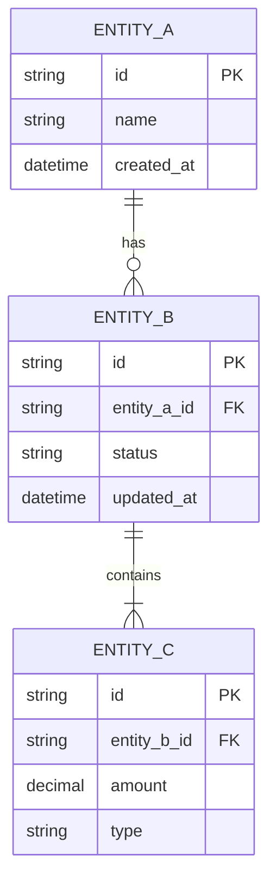
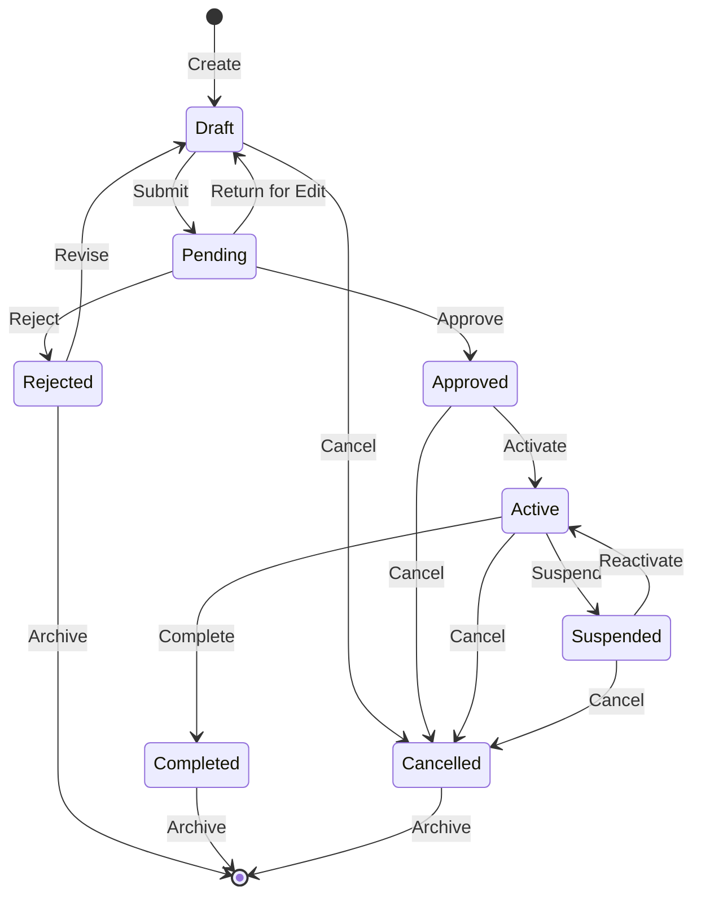

# Data Model Template

**Output File**: `.kiro/specs/[feature-name]/data-model.md`

**Standards**: Must follow `helper-diagram-standards.md`

---

## File Template

```markdown
# Data Model: [Feature Name]

**Created**: [Date]
**Last Updated**: [Date]
**Status**: Draft | Review | Approved

---

## 1. Data Model Overview

### 1.1 Entity Relationship Diagram



### 1.2 Entity Summary

| Entity | Description | Key Attributes | Relationships |
|--------|-------------|----------------|---------------|
| **Entity A** | [Description] | id, name | Has many Entity B |
| **Entity B** | [Description] | id, status | Belongs to Entity A, Has many Entity C |
| **Entity C** | [Description] | id, amount, type | Belongs to Entity B |

---

## 2. Entity Definitions

### 2.1 [Entity Name]

#### Basic Information

| Property | Value |
|----------|-------|
| **Entity ID** | ENT-001 |
| **Name** | [Entity Name] |
| **Description** | [What this entity represents] |
| **Bounded Context** | [Domain context this entity belongs to] |
| **Aggregate Root** | Yes / No |

#### Attributes

| Attribute | Type | Required | Unique | Default | Description | Constraints |
|-----------|------|----------|--------|---------|-------------|-------------|
| `id` | string | Yes | Yes | UUID | Primary identifier | UUID v4 format |
| `name` | string | Yes | No | - | Display name | 1-100 characters |
| `email` | string | Yes | Yes | - | Email address | Valid email format |
| `status` | enum | Yes | No | `active` | Current status | [active, inactive, suspended] |
| `created_at` | datetime | Yes | No | NOW() | Creation timestamp | ISO 8601 |
| `updated_at` | datetime | Yes | No | NOW() | Last update timestamp | ISO 8601 |
| `metadata` | json | No | No | {} | Additional data | Valid JSON object |

#### Business Rules

| Rule ID | Rule | Validation |
|---------|------|------------|
| BR-001 | [Rule description] | [How to validate] |
| BR-002 | [Rule description] | [How to validate] |

#### Indexes

| Index Name | Columns | Type | Purpose |
|------------|---------|------|---------|
| `idx_entity_name` | name | B-tree | Name search optimization |
| `idx_entity_status` | status | B-tree | Status filtering |
| `idx_entity_created` | created_at | B-tree | Time-based queries |

---

## 3. Relationships

### 3.1 Relationship Matrix

| From Entity | Relationship | To Entity | Cardinality | Description |
|-------------|--------------|-----------|-------------|-------------|
| Entity A | has | Entity B | 1:N | One A has many B |
| Entity B | contains | Entity C | 1:N | One B contains many C |
| Entity A | references | Entity D | N:M | Many-to-many via junction |

### 3.2 Relationship Details

#### [Relationship Name]

| Property | Value |
|----------|-------|
| **From** | Entity A |
| **To** | Entity B |
| **Cardinality** | One-to-Many (1:N) |
| **Navigability** | Bidirectional / Unidirectional |
| **Cascade Delete** | Yes / No |
| **Foreign Key** | `entity_b.entity_a_id` |

**Business Rule**: [Rule governing this relationship]

---

## 4. State Diagrams

### 4.1 [Entity Name] Lifecycle



### 4.2 State Definitions

| State | Description | Entry Actions | Exit Actions | Allowed Transitions |
|-------|-------------|---------------|--------------|---------------------|
| **Draft** | Initial creation state | Initialize defaults | Validate required fields | Submit, Cancel |
| **Pending** | Awaiting approval | Notify approvers | - | Approve, Reject, Return |
| **Approved** | Approved but not active | Log approval | - | Activate, Cancel |
| **Active** | Currently in use | Start monitoring | Stop monitoring | Suspend, Complete, Cancel |
| **Suspended** | Temporarily disabled | Log suspension | - | Reactivate, Cancel |
| **Completed** | Successfully finished | Calculate metrics | Archive data | - |
| **Rejected** | Not approved | Notify creator | - | Revise, Archive |
| **Cancelled** | Terminated | Log cancellation | Release resources | - |

### 4.3 State Transition Rules

| From State | To State | Trigger | Guard Condition | Action |
|------------|----------|---------|-----------------|--------|
| Draft | Pending | Submit | All required fields filled | Send notification |
| Pending | Approved | Approve | Approver has permission | Log approval |
| Active | Suspended | Suspend | Valid reason provided | Pause operations |

---

## 5. Data Constraints

### 5.1 Validation Rules

| Constraint ID | Entity | Field | Rule | Error Message |
|---------------|--------|-------|------|---------------|
| VAL-001 | User | email | Must be valid email format | "Invalid email format" |
| VAL-002 | Order | amount | Must be > 0 | "Amount must be positive" |
| VAL-003 | Product | price | Must be >= 0 | "Price cannot be negative" |

### 5.2 Referential Integrity

| Constraint | Parent | Child | On Delete | On Update |
|------------|--------|-------|-----------|-----------|
| FK_entity_b_a | Entity A | Entity B | CASCADE / RESTRICT / SET NULL | CASCADE |
| FK_entity_c_b | Entity B | Entity C | CASCADE / RESTRICT / SET NULL | CASCADE |

### 5.3 Uniqueness Constraints

| Constraint | Entity | Fields | Scope | Description |
|------------|--------|--------|-------|-------------|
| UQ_user_email | User | email | Global | Email must be unique across all users |
| UQ_order_ref | Order | reference, tenant_id | Per Tenant | Order reference unique within tenant |

---

## 6. Data Volume Estimates

### 6.1 Growth Projections

| Entity | Initial Count | Monthly Growth | 1-Year Projection | Storage (per record) |
|--------|---------------|----------------|-------------------|---------------------|
| User | 1,000 | +500/month | 7,000 | ~2 KB |
| Order | 5,000 | +2,000/month | 29,000 | ~5 KB |
| OrderItem | 15,000 | +6,000/month | 87,000 | ~1 KB |

### 6.2 Performance Considerations

| Query Pattern | Frequency | Expected Latency | Index Strategy |
|---------------|-----------|------------------|----------------|
| User lookup by email | High | < 10ms | Unique index on email |
| Orders by date range | Medium | < 100ms | Composite index on (user_id, created_at) |
| Full-text search | Low | < 500ms | Full-text index |

---

## 7. Data Dictionary

### 7.1 Standard Field Types

| Type Name | Base Type | Format | Example |
|-----------|-----------|--------|---------|
| `id` | string | UUID v4 | `550e8400-e29b-41d4-a716-446655440000` |
| `email` | string | RFC 5322 | `user@example.com` |
| `phone` | string | E.164 | `+1234567890` |
| `currency` | decimal | 2 decimals | `99.99` |
| `percentage` | decimal | 4 decimals | `0.1525` (15.25%) |
| `datetime` | string | ISO 8601 | `2024-01-15T10:30:00Z` |
| `date` | string | ISO 8601 | `2024-01-15` |

### 7.2 Enumeration Types

#### [Enum Name]

| Value | Label | Description |
|-------|-------|-------------|
| `active` | Active | Entity is currently active |
| `inactive` | Inactive | Entity is disabled |
| `suspended` | Suspended | Entity is temporarily suspended |

---

## 8. Domain Glossary

| Term | Definition | Synonyms | Related Entities |
|------|------------|----------|------------------|
| **[Term 1]** | [Definition] | [Synonyms to avoid] | Entity A, Entity B |
| **[Term 2]** | [Definition] | [Synonyms to avoid] | Entity C |

---

## 9. Data Model Traceability

### 9.1 Requirements Mapping

| Entity | Source Requirements | User Stories |
|--------|---------------------|--------------|
| Entity A | REQ-001, REQ-002 | US-001, US-003 |
| Entity B | REQ-003, REQ-005 | US-002, US-004 |

### 9.2 Change History

| Version | Date | Author | Changes |
|---------|------|--------|---------|
| 1.0 | [Date] | [Author] | Initial data model |
| 1.1 | [Date] | [Author] | Added Entity C, updated relationships |

---

## 10. Notes and Decisions

### 10.1 Design Decisions

| Decision ID | Decision | Rationale | Alternatives Considered |
|-------------|----------|-----------|------------------------|
| DD-001 | [Decision] | [Why this choice] | [Other options] |

### 10.2 Open Questions

| Question ID | Question | Impact | Status |
|-------------|----------|--------|--------|
| Q-001 | [Question] | [Impact if unresolved] | Open / Resolved |

### 10.3 Assumptions

| Assumption ID | Assumption | Risk if Invalid |
|---------------|------------|-----------------|
| A-001 | [Assumption] | [Risk] |
```
